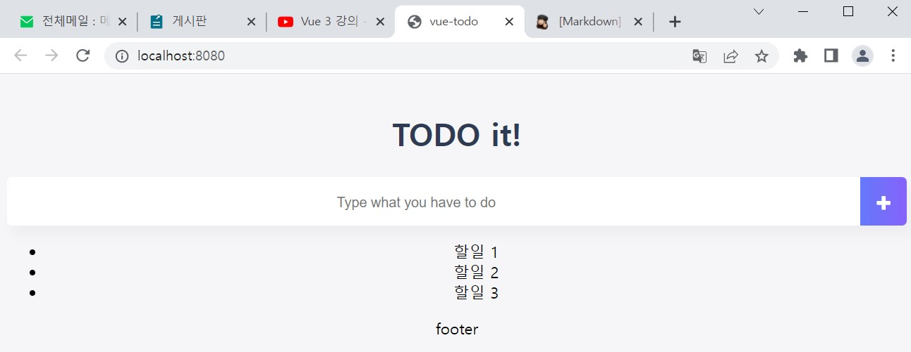

**할 일 관리 앱 만들기**  
참고: Vue.js 입문 (이지스퍼블리싱)의 실전 애플리케이션 만들기 부분 실습
>**Where?**  
컴포넌트 기반으로 애플리케이션 화면을 설계하는 방법부터  
**To**   
컴포넌트 간 통신 방식까지

---
📕 index  
[1. 할일 관리 앱 살펴보기](#1-할-일-관리-앱-살펴보기1.-할-일-관리-앱-살펴보기)  
[2. 프로젝트 생성하고 구조 확인하기](#2-프로젝트-생성하고-구조-확인하기)  
[3. 컴포넌트 생성하고 등록하기](#3-컴포넌트-생성하고-등록하기)  
[4. 컴포넌트 내용 구현하기](#4-컴포넌트-내용-구현하기)  
[5. 기존 애플리케이션 구조의 문제점 해결하기](#5-기존-애플리케이션-구조의-문제점-해결하기)  
[6. 더 나은 사용자 경험을 위한 기능 추가하기](#6-더-나은-사용자-경험을-위한-기능-추가하기)  

---
# 1. 할 일 관리 앱 살펴보기
## 왜 할 일 관리 앱을 만들어야 하나?
>실무에서 서비스를 만들 때 사용하는 데이터 조작 방법 (삽입, 조회, 변경, 삭제)을 간단한 코드로 구현해 볼 수 있기 때문

-> 기업의 실제 서비스는 데이터 조작 방법 4가지에서 크게 벗어나지 않고 화면을 더 추가해 복잡도만 높여 놓은 수준

>또 적은 코드 양으로 **컴포넌트 구조화**와 **컴포넌트 통신**을 구현할 수 있다.
---
## 할 일 관리 앱 살펴보기
할 일 관리앱은 모바일 화면에 최적화 되어있다.  
https://vuejstodo-aa185.firebaseapp.com/ 링크에 접속하면 완성된 애플리케이션을 확인할 수 있다.

---  

## 애플리케이션 컴포넌트 구조도
화면 1개를 큰 컴포넌트 1개로 놓고 페이지를 제작하는 방식보다  
인풋 박스, 목록, 버튼 등의 작은 역할 단위로 컴포넌트를 관리하는 것이  
다른 페이지에서 해당 코드를 **재사용**하기 수월하기 때문에  
>컴포넌트 기반 프레임워크에서는 컴포넌트의 단위를 작게 설계하도록 권고함  
---
# 2. 프로젝트 생성하고 구조 확인하기
## 뷰 CLI를 이용한 프로젝트 생성
>1. 프로젝트 초기 구성을 위해 **뷰 CLI**로 프로젝트를 생성한다.  
>> 뷰 CLI를 사용하기 위해선 사전에 설치 작업을 진행해야 한다.  
>> 그리고 node.js가 먼저 설치되어 있어야 한다.  
>> 터미널에서 ``npm install vue-cli -global``을 입력한다.

>2. 원하는 위치에 새로운 폴더 ``vue-todo``를 생성하고 vue-todo 폴더 내에서 명령 프롬프트 창을 연다.
> 3. 명령 프롬프트 창에 ``vue init webpack-simple``을 입력하고 실행한다.
>   
> (위 이미지처럼 webpack-simple 프로젝트가 생성됨을 확인 할 수 있다.)
> 4. ``npm install`` 명령어를 입력하여 package.json 파일 (npm 설정 파일)에 등록된 자바스크립트 라이브러리를 모두 다운로드한다.
> 5. 설치를 완료한 후 ``npm run dev``를 실행하여 애플리케이션이 정상 실행되는지 확인한다.


여기까지 된다면 뷰 CLI 초기 프로젝트 구성을 완료한 것이다.

---
## 프로젝트 초기 설정
다음 단계로 넘어가기 전에  
프로젝트에 **반응형 웹 디자인 태그**와 이후에 사용할 **아이콘 CSS**를 설정한다.

### 반응형 웹 디자인 태그 설정
>반응형 웹 디자인(Responsive Web Design)은 어느 기기에서도 깨지지 않는 자연스러운 레이아웃을 제공하는 웹 디자인 방법

``index.html`` 파일의 <head> 태그에 아래와 같이 <meta> 태그를 추가한다.

이렇게 viewport 메타 태그를 추가하면 PC 웹 화면 + 모바일 웹에서도 레이아웃이 깨지지 않고 잘 보인다.

>``width=device-width`` 속성: 기기의 너비만큼 웹 페이지의 너비를 지정하라  
>``initial-scale=1.0`` 속성: 페이지의 배율, 페이지가 로딩되었을 때 줌 (zoom) 레벨

### 어썸 아이콘 CSS 설정
애플리케이션의 예쁜 UI를 위해  
버튼은 일반 문자열 대신 **어썸 아이콘** (Awesome Icon)을 활용
> **어썸 아이콘**은 대중적으로 사용되는 아이콘 CSS

어썸 아이콘을 사용하려면 다음과 같이 `<head>` 태그에 `<link>` 태그를 추가한다. 


### 폰트와 파비콘 설정

애플리케이션에서 사용할 ``폰트(font)``와 ``파비콘(favicon)``을 설정한다.
> **파비콘**은 브라우저로 웹 앱을 실행했을 때 웹 사이트 제목의 왼쪽에 표시되는 **로고**  

설정
- 폰트: 구글 폰트 Ubuntu
- 파비콘: 뷰에서 제공하는 기본 로고

(구글 폰트와 파비콘을 추가한 `<head>`)  
검색 엔진에서 **favicon generator**를 검색하면 나오는 사이트에 접속한 후 사이트 안내에 따라 assets 폴더 밑의 logo.png 파일을 파비콘 파일로 변환한다.
---

# 3. 컴포넌트 생성하고 등록하기
프로젝트 초기 구성을 완료하였고  
애플리케이션 구동에 필요한 컴포넌트들을 생성하고 등록한다.  
>대상 컴포넌트: **TodoHeader, TodoInput, TodoList, TodoFooter**  
총 4개

## 컴포넌트 생성
프로젝트 폴더에서 src 폴더 밑에 ``components`` 폴더를 생성한다.  
그 아래에 ``TodoHeader.vue``, ``TodoInput.vue``, ``TodoList.vue``, ``TodoFooter.vue``를 생성한다.  
  
(이미지: 컴포넌트 생성 후 프로젝트 폴더 구조)
> 컴포넌트는 관례상 ``src/components`` 폴더에서 관리한다.  
> 이렇게 컴포넌트를 한 곳에 모아 놓으면 폴더 구조로 깔끔하고 추후 재활용할 때도 접근하기 쉽다.

그 후 각 컴포넌트를 한눈에 구분할 수 있도록  
4개의 vue 파일에 간단한 코드를 삽입한다.

|TodoHeder.vue|TodoInput.vue|
|---|---|
|||
|TodoList.vue|TodoFooter.vue|
|||

.vue 파일의 기본 구조에서  
`<template>` 영역에 `<div>` 태그를 추가하고   
컴포넌트 이름을 텍스트로 삽입하였다.

이렇게 할 경우 컴포넌트를 등록했을 때 다른 컴포넌트와의 구분이 쉬워진다.

---
## 컴포넌트 등록
앞에서 생성한 4개의 컴포넌트를 등록하여 화면에 나타내보기  
>1. 애플리케이션에서 사용할 컴포넌트는 모두 최상위 컴포넌트인 ``App.vue``에 등록한다.  
>2. ``src/App.vue``의 기존 코드 내용을 모두 지우고 새로 코드를 작성한다.  
  
(이미지: 불필요한 코드를 제거한 App.vue 파일)  
>3. 지역 컴포넌트 형식을 App.vue 파일에 적용 및 등록한다.
  
(App.vue에 등록한 지역 컴포넌트)
>> 하지만 App.vue 파일에서 4개의 컴포넌트 파일 내용을 불러오는 코드를 추가하지 않아서 내용을 인식하지 못한다.  
그래서 아래와 같이 ``import from`` 구문으로 받아오는 형식을 취한다.

싱글 파일 컴포넌트 체계 (.vue 파일 체계)에서는 특정 컴포넌트에서 다른 위치에 있는 컴포넌트의 내용을 불러올 때 아래의 형식을 사용한다.  
```js
// 컴포넌트 내용을 불러오기 위한 ES6 import 구문
import 불러온 파일의 내용이 담길 객체 from '불러올 파일 위치';

```

``App.vue`` 파일에서 다른 컴포넌트의 내용을  
``import from`` 구문으로 다 받아와서 ``components`` 속성에 연결해준다.

```html
<!-- import 구문으로 컴포넌트 내용을 불러와서 등록하는 코드 -->
<script>
import TodoHeader from './components/TodoHeader.vue'
import TodoInput from './components/TodoInput.vue'
import TodoList from './components/TodoList.vue'
import TodoFooter from './components/TodoFooter.vue'
...
</script>
```

> ### 알아두기
>컴포넌트 내용을 불러올 때 ES5 문법과 ES6 문법의 차이  
(TodoHeader 컴포넌트 등록 부분에만 적용한 예)
>```html
><script>
>   // 컴포넌트 내용
>    var TodoHeader = {
>        template: '<div>header</div>'
>    };
>
>   export default {
>        components: {
>            // 컴포넌트 이름: 컴포넌트 내용
>            'TodoHeader': TodoHeader
>        }
>   }
></script>
>```
>> ES5는 **var**에 직접 담는다.  
>> ES6는 **import**로 vue 파일을 가지고 온다.

>4. 컴포넌트 등록을 완료한 상태에서  
마지막으로 컴포넌트 태그 4개를 App.vue의 `<div id="app">` 태그 안에 추가한다.  
  
(등록한 컴포넌트 4개를 HTML에 표시하는 코드)

>5. 파일 저장 후 명령 프롬프트에서 ``npm run dev``를 이용해 서버를 실행시킨다.  

>> 크롬 개발자 도구를 열어 뷰 개발자 도구를 확인하면  
App이라는 최상위 컴포넌트 아래에  
TodoHeader, TodoInput, TodoList, TodoFooter가 각각 하위 컴포넌트로 생성된 것을 확인 가능

---
# 4. 컴포넌트 내용 구현하기
컴포넌트를 생성하고 등록까지 완료한 상태에서  
컴포넌트 역할에 맞춰 컴포넌트 기능을 구현해본다.  

>컴포넌트별로 구현할 기능  
>- TodoHeader: 애플리케이션 이름 표시
>- TodoInput: 할 일 입력 및 추가
>- TodoList: 할 일 목록 표시 및 특정 할 일 삭제
>- TodoFooter: 할 일 모두 삭제

---

## 애플리케이션 제목을 보여주는 TodoHeader 컴포넌트

### 애플리케이션 제목 추가하기
어떤 애플리케이션인지 파악하기 쉽게 애플리케이션 제목을 추가한다.  
전에 TodoHeader 컴포넌트를 등록하면서 간단하게 `<div>` 태그 정도만 작성하였는데, `<div>` 태그를 삭제하고 `<header>`와 `<h1>`태그를 활용하여 제목을 표시한다.
```html
<!-- TodoHeader 컴포넌트의 <template> 내용 -->
<template>
    <header>
        <h1>TODO it!</h1>
    </header>
</template>
```

### CSS로 제목 꾸미기
제목의 스타일링을 위해 최상위 컴포넌트인 **App.vue**와 **TodoHeader.vue**에 다음과 같이 CSS를 추가한다.

```html
<!-- App.vue의 CSS 스타일 -->
<style>
    body{ 
        text-align: center;
        background-color: #F6F6F8;
    }
    input {
        border-style: groove;
        width: 200px;
    }
    button {
        border-style: groove;
    }
    .shadow {
        box-shadow: 5px 10px 10px rgba(0, 0, 0, 0.03)
    }
</style>
```
```html
<!-- TodoHeader.vue의 CSS 스타일 -->
<style scoped>
    h1{
        color: #2F3B52;
        font-weight: 900;
        margin: 2.5rem 0 1.5rem;
    }
</style>
```

App.vue와 TodoHeader.vue에 추가한 스타일의 역할 표  

<table>
  <tr align='center'>
    <th>컴포넌트</th>
    <th>CSS 속성</th>
    <th>설명</th>
  </tr>
  <tr>
    <td align='center' rowspan='4'>App.vue</td>
    <td>background-color</td>
    <td>애플리케이션 전체의 배경색을 꾸미기 위해 지정</td>
  </tr>
  <tr>
    <td>text-align</td>
    <td>애플리케이션 전체에서 사용하는 텍스트 정렬 방식 선택</td>
  </tr>
    <tr>
    <td>border-style</td>
    <td>할 일을 입력하는 인풋 박스의 테두리 모양 정의</td>
  </tr>
    <tr>
    <td>box-shadow</td>
    <td>할 일을 입력하는 인풋 박스와 할 일 아이템의 아래 그림자 정의</td>
  </tr>
  <tr>
  </tr>
  <tr>
    <td align='center' rowspan='3'>TodoHeader.vue</td>
    <td>color</td>
    <td>애플리케이션 제목의 텍스트 색깔 지정</td>
  </tr>
  <tr>
    <td>font-weight</td>
    <td>애플리케이션 제목의 텍스트 굵기 지정</td>
  </tr>
    <tr>
    <td>margin</td>
    <td>애플리케이션 제목의 텍스트 여백 지정</td>
  </tr>
</table>

>`<style>` 태그에 사용된 **scoped**는 **뷰**에서 지원하는 속성이며, 스타일 정의를 해당 컴포넌트에만 적용하겠다는 의미

  
(TodoHeader 컴포넌트 등록 결과)

---
## 할 일을 입력하는 TodoInput 컴포넌트
TodoInput 컴포넌트를 구현해본다.

### 인풋 박스와 버튼 추가하기
>1. 텍스트 값을 입력받기 위한 `<input>` 태그와 텍스트 값을 저장하기 위한 `<button>` 태그를 추가한다.  
>> - `<button>` 태그의 이름은 '추가'로 지정한다.  
태그를 추가하면 화면에서 input 텍스트가 있던 자리에 인풋 박스와 버튼이 생긴다.
>2. 인풋 박스에 텍스트를 입력했을 때 뷰 인스턴스에서 텍스트 값을 인식할 수 있게 ``v-model`` 디렉티브와 데이터 속성 ``newTodoItem``을 다음과 같이 추가한다.

```html
<!-- 인풋 박스에 v-model 디렉티브와 data 속성을 추가한 TodoInput 컴포넌트 코드 -->
<template>
    <div>
        <input type="text" v-model="newTodoItem">
        <button>추가</button>
    </div>
</template>

<script>
export default {
    data() {
        return {
            newTodoItem: ''
        }
    }
}
</script>
```
> 3. 위 코드를 저장하고 다시 애플리케이션을 실행한 후 뷰 개발자 도구를 연다.
>> 뷰 개발자 도구에서 'Components' 탭의 `<App>` 아래 있는 `<TodoInput>` 부분을 클릭하면 **newTodoItem** 값이 ''로 되어 있다.  
이제 인풋 박스에 Hello 텍스트를 입력하면서 newTodoItem의 값을 지켜보면 텍스트를 입력함에 따라 newTodoItem 값도 같이 갱신되는 것을 확인할 수 있다.
>   
>   
> (인푹 박스의 인력 값에 따라 갱신되는 newTodoItem 데이터)

### 텍스트를 저장하기 위한 버튼 이벤트 추가하기
인풋 박스에 입력한 텍스트 값을 뷰에서 인식할 수 있게 되었다.  
이제 입력한 텍스트 값을 데이터 저장소인 **로컬 스토리지**에 저장한다.
> 1. [추가] 버튼을 클릭했을 때 특정 동작을 수행할 수 있게 ``v-on:click``에 버튼 이벤트 **addTodo**를 지정한다.
> 2. 버튼 이벤트 ``addTodo()``의 로직은 ``methods``에 정의한다.
```js
<!-- 버튼 클릭 이벤트 addTodo를 추가한 코드 -->
<template>
    <div>
        <input type="text" v-model="newTodoItem">
        <button v-on:click="addTodo">추가</button>
    </div>
</template>

<script>
export default {
    data() {
        return {
            newTodoItem: ''
        }
    },
    methods: {
        addTodo() {
            console.log(this.newTodoItem);
        }
    }
}
</script>
<!-- 여기서 사용한 this.newTodoItem의 this는 해당 컴포넌트를 가리킨다. -->

```

> 3. 버튼이 정상적으로 동작하는 지 확인하기 위해 인풋 박스에 입력된 텍스트 데이터 (newTodoItem)를 ``console.log()``로 출력한다.  
인풋 박스에 **Do it**을 입력하고 [추가] 버튼을 클릭하면 콘솔에 텍스트 값이 표시된다.  


### 입력받은 텍스트를 로컬 스토리지에 저장하기
버튼 이벤트가 제대로 동작하는 것을 확인했으니  
확인용으로 작성한 ``console.log(this.newTodoItem);``은 삭제한다.  
그리고 입력받은 텍스트를 로컬 스토리지의 ``setItem()`` API를 이용하여 저장한다.  
> ``setItem()``은 로컬 스토리지에 데이터를 **추가**하는 API  
API 형식은 **키, 값** 형태이며, 저장 기능을 단순하게 하기 위해 키, 값 모두 입력받은 텍스트로 지정한다.

```js
<!-- localStorage.setItem() 코드 -->
methods: {
    addTodo() {
        localStorage.setItem(this.newTodoItem, this.newTodoItem);
    }
}
```

methods의 내용을 위와 같이 변경하고 저장한다.  
인풋 박스에 Do it을 입력하고 [추가] 버튼을 클릭하면 로컬 스토리지에 텍스트 값이 저장된다.
> 확인 방법: 크롬 개발자 도구 [Application -> Local Storage -> http://localhost:8080] 클릭 후 확인
>   
> (로컬 스토리지에 인풋 박스의 텍스트를 저장한 화면)

### addTodo() 안에 예외 처리 코드 넣기
인풋 박스에 입력된 텍스트가 없을 경우 로컬 스토리지에 데이터가 저장되지 않게 예외 처리 코드를 추가한다.  
기존의 ``addTodo()`` 메서드를 다음과 같이 변경한다.

```js
methods: {
    addTodo() {
        if (this.newTodoItem !== "") {
            var value = this.newTodoItem && this.newTodoItem.trim();
            localStorage.setItem(value, value);
            this.clearInput();
        }
    },
    clearInput() {
        this.newTodoItem = ''l
    }
}
```
> `if (this.newTodoItem !== "")`  
>> 1. 인풋 박스의 입력 값이 있을 때만 저장     

> `var value = this.newTodoItem && this.newTodoItem.trim();`  
>> 2. 인풋 박스에 입력된 텍스트의 앞뒤 공백 문자열 제거

> `this.clearInput()`
>> 3. 인풋 박스의 입력 값을 초기화

변경 전의 ``addTodo()``는 로컬 스토리지로 데이터를 저장하는 코드만 있었다.  
그래서 만약 인풋 박스에 텍스트를 입력하지 않은 상태에서 [추가] 버튼을 클릭하면  
빈 데이터가 로컬 스토리지에 저장되는 문제가 생긴다.

여기서 `this.clearInput()`을 보면 아래의 ``clearInput()`` 메서드를 호출하고 있다는 것을 알 수 있다.  
addTodo() 메서드 안에서 ``this``를 사용하면 해당 컴포넌트 (여기서는 App)를 가리킨다.  

`clearInput()` 메서드는 App 컴포넌트에 정의되어 있으므로  
``addTodo()``에서 `this`를 사용하면 ``clearInput()`` 메서드에 접근할 수 있다.  

> <span style = "color: #00ff00">알아두면 좋은 것</span>  
> <h2>디자인 패턴: 단일 책임 원칙</h2>
> 
> 함수 하나가 하나의 기능만 담당하도록 설계하는 객체 지향 프로그래밍의 디자인 패턴  
>> 단일 책임 원칙에 따라 할 일 텍스트를 저장하는 코드는 `addTodo()`에 넣고,  
>> 인풋 박스의 내용을 비우는 코드는 `clearInput()`에 넣는다.
>>> 만약 다른 메서드에서 인풋 박스의 내용을 비우는 코드가 필요할 경우  
`this.newTodoItem = '';` 코드 대신에 `this.clearInput();`을 호출한다.
---
### 아이콘 이용해 직관적 버튼 모양 만들기
현재 버튼은 `<button>` 태그와 '추가'라는 텍스트를 사용하고 있다.  
앞에서 설치한 어썸 아이콘의 + 아이콘을 이용하면 더 직관적인 버튼 모양을 만들 수 있다.

> 1. `<template>` 태그에 기존 `<button>` 태그를 삭제하고 `<span>`, `<i>` 태그를 아래와 같이 추가한다.

```html
<!-- TodoInput 컴포넌트의 template 코드 -->
<template>
    <div class="inputBox shadow">
        <input type="text" v-model="newTodoItem" placeholder="Type what you have to do" v-on:keyup.enter="addTodo">
        <span class="addContainer" v-on:click="addTodo">
            <i class="addBtn fas fa-plus" aria-hidden="true"></i>
        </span>
    </div>
</template>
```

> `<template>` 변경 내용
> - `placeholder`: 인풋 박스의 힌트 속성
> - `v-on:keyup.enter`: 인풋 박스에서 Enter를 눌렀을 때 동작하는 속성
> - `<span>`: `<button>` 대신 클릭 이벤트를 받을 태그
> - `<i class="fa fa-plus">`: 어썸 아이콘의 + 아이콘 추가

> `<stlye>` 변경 내용
> - `outline`: 할 일을 입력하는 인풋 박스의 선 스타일 지정
> - `background`: 인풋 박스의 배경색 지정
> - `height`: 인풋 박스의 높이 설정
> - `line-height`: 인풋 박스에 입력되는 텍스트의 중앙 정렬을 위해 설정
> - `border-radius`: 인풋 박스의 둥근 테두리 속성 설정
> - `float`: 할 일 추가 버튼이 표시될 위치 정의
> - `vertical-align`: 할 일 추가 아이콘의 수직 정렬 정의

  
(TodoInput 컴포넌트의 CSS 스타일링이 완료된 화면)

---
## 저장된 할 일 목록을 표시하는 TodoList 컴포넌트
**TodoList** 컴포넌트는 앞에서 저장한 할 일 목록을 보여주는 컴포넌트  
현재 로컬 스토리지에 저장된 할 일을 모두 불러와 화면에 보여준다.

### 할 일 목록 만들기
목록 아이템이 배치될 영역을 확인하기 위해  
`<ul>` 태그와 `<li>` 태그를 추가한다.

```html
<!-- 목록을 나타내는 <ul> 태그 -->
<template>
    <section>
        <ul>
            <li>할일 1</li>
            <li>할일 2</li>
            <li>할일 3</li>
        </ul>
    </section>
</template>
```



앞의 화면은 `<li>` 태그에 텍스트 값을 직접 다 일일이 추가하여 출력한 화면  
하지만 이렇게 저장된 데이터의 개수만큼 일일이 `<li>` 태그를 추가하는 방법은 비효율적

> 직접 텍스트를 입력하는 대신 **로컬 스토리지의 데이터 (아이템) 개수**만큼 목록에 추가하여 표시한다.  
목록을 표시하기 위해서는 2단계를 거친다.
>> 1. 로컬 스토리지 데이터를 뷰 데이터에 저장
>> 2. 뷰 데이터의 아이템 개수만큼 리스트 아이템 표시

### 로컬 스토리지 데이터를 뷰 데이터에 저장하기

```js
...
export default {
    data() {
        return {
            todoItems: []
        }
    },
    created() {
        if (localStorage.length > 0) {
            for (var i = 0; i < localStorage.length; i++) {
                this.todoItems.push(local Storage.key(i));
            }
        }
    },
...
}
```

> 1. 로컬 스토리지의 데이터를 담을 `todoItems` 데이터 속성을 **빈 배열**로 선언한다.
> 2. `created()` 라이프 사이클 훅에 for 반복문과 push()로 로컬 스토리지의 모든 데이터를 todoItems에 담는 로직을 추가한다.
>> - `todoItems`를 객체가 아닌 배열로 선언한 이유: **v-for** 목록 렌더링에 활용하기 위해  
>>> - 로컬 스토리지에 저장된 모든 아이템을 한 번에 불러오는 API는 없어 반복문으로 아이템을 모두 불러와야 한다.  
>>> - `push()`: 배열의 끝 요소에 배열 아이템을 하나씩 추가하는 자바스크립트 내장 API

뷰의 인스턴스가 생성되자마자 뷰 데이터에 접근할 수 있도록  
`created()` 라이프 사이클 훅에서 로컬 스토리지의 데이터를 뷰 데이터로 옮긴다.

### 뷰 데이터의 아이템 개수만큼 화면에 표시하기
두 번째 단계는 `v-for 디렉티브`로 구현한다.

```html
<!-- v-for 디렉티브를 이용한 할 일 목록 렌더링 -->
<template>
    <section>
        <ul>
            <li v-for="todoItem in todoItems">{{ todoItem }}</li>
        </ul>
    </section>
</template>
```

> `v-for 디렉티브`: 뷰 데이터 속성 `todoItems`의 내용물 개수만큼 반복해서 `<li>` 태그를 출력하는 디렉티브
>> `todoItems`의 타입은 **배열**이기 때문에 배열의 요소 숫자만큼 반복해서 출력한다.  

  
(로컬 스토리지에 저장된 아이템을 모두 목록에 출력한 화면)

❗ 문제점  
할 일을 추가해도 화면이 바로 갱신되지 않는다.  
할 일을 추가하고 나서 추가된 할 일을 확인하려면 브라우저를 새로 고침해야 한다.  
-> 해결 방법: [5. 기존 애플리케이션 구조의 문제점 해결하기](#5-기존-애플리케이션-구조의-문제점-해결하기)  에서 설명

---
## TodoList.vue에 할 일 삭제 기능 추가하기
> 할 일을 삭제하는 기능의 세부 동작 순서  
> 1. 선택한 할 일을 뷰에서 인식
> 2. 선택한 할 일을 로컬 스토리지에서 삭제
> 3. 선택한 할 일을 뷰 데이터에서 삭제

### 할 일 목록 & 삭제 버튼 마크업 작업하기
삭제 기능을 구현하기 전에 간단한 마크업 (HTML, CSS) 작업을 수행한다.

```html
<!-- TodoList 컴포넌트의 template 코드 -->
<template>
    <section>
        <ul>
            <li v-for="todoItem in todoItems" class="shadow">
                <i class="checkBtn fas fa-check" aria-hidden="true"></i>
                {{ todoItem }}
                <span class="removeBtn" type="button" @click="removeTodo(todoItem, index)">
                    <i class="far fa-trash-alt" aria-hidden="true"></i>
                </span>
            </li>
        </ul>
    </section>
</template>
```
`<i>` 태그로 할 일 체크 버튼과 사제 버튼에 사용할 체크 하이콘, 휴지통 아이콘을 추가한다.  
각 아이콘의 영역이 좁기 때문에 아이콘을 클릭했을 때 이벤트를 잘 잡을 수 있게   
`<i>` 태그에 상위 태그 `<span>`을 두어 클릭할 수 있는 영역을 키운다.

`<style>` 태그도 다음과 같이 작성한다.

```html
<!-- TodoList 컴포넌트의 CSS 코드 -->
<style scoped>
    ul {
        list-style-type: none;
        padding-left: 0px;
        margin-top: 0;
        text-align: left;
    }

    li {
        display: flex;
        min-height: 50px;
        height: 50px;
        line-height: 50px;
        margin: 0.5rem 0;
        padding: 0 0.9rem;
        background: white;
        border-radius: 5px;
    }

    .checkBtn {
        line-height: 45px;
        color: #62acde;
        margin-right: 5px;
    }
    .removeBtn {
        margin-left: auto;
        color: #de4343;
    }
</style>
```

  
(TodoList 컴포넌트의 CSS 스타일링을 완료한 화면)

### 할 일 삭제 버튼에 클릭 이벤트 추가하기
이제 (쓰레기통) 아이콘을 클릭했을 때 삭제하는 기능이 실행되도록 클릭 이벤트를 추가하는 작업을 한다.  
(쓰레기통) 아이콘의 근처 영역을 클릭해도 클릭 이벤트가 실행될 수 있게 `<span>` 태그에 클릭 이벤트를 추가한다.  
- @click은 v-on:click과 동일하게 동작함

```html
<!-- 클릭 이벤트 removeTodo를 추가한 코드 -->
<span class="removeBtn" type="button" @click="removeTodo">
```

클릭 이벤트에는 이벤트가 잘 실행되는지 확인하는 `console.log()`를 추가한다.

```js
// 메서드에 정의한 removeTodo 코드
methods: {
    removeTodo() {
        console.log('clicked');
    }
}
```

  
((쓰레기통) 아이콘 클릭시 console 탭에서 나오는 화면)


## 선택한 할 일을 뷰에서 인식하도록 만들기
(쓰레기통) 아이콘을 클릭했을 때 선택한 할 일의 **텍스트 값**과 **인덱스**를 가져오는 코드를 추가해본다.  
여기서 할 일 목록의 인덱스는 뷰에서 내부적으로 관리하고 있다.  
`template` 코드와 `removeTodo()` 코드를 수정하여 텍스트 값과 인덱스를 반환한다.

```html
<!-- 선택한 할 일 아이템을 인식하기 위한 template 코드 -->
<template>
    <li v-for="(todoItem, index) in todoItems" :key="todoItem" class="shadow">
        <i class="checkBtn fas fa-check" aria-hidden="true"></i>
        {{ todoItem }}
        <span class="removeBtn" type="button" @click="removeTodo(todoItem, index)">
            <i class="far fa-trash-alt" aria-hidden="true"></i>
        </span>
    </li>
</template>
```
> 이전 코드와 비교했을 때 `v-for 디렉티브`에 **index**가 추가되었다.  
>> **index**는 임의로 정의한 변수가 아니라 `v-for 디렉티브`에서 기본 제공하는 변수

> `v-for 디렉티브`로 반복한 요소는 모두 뷰에서 내부적으로 인덱스를 부여한다.

이제 변경된 코드를 저장하고 특정 할 일의 (쓰레기통) 아이콘을 클릭하면 할 일의 텍스트 값과 인덱스 값이 콘솔에 표시된다.
```html
<!-- 선택한 할 일을 인식하는 removeTodo 코드 -->
methods: {
    removeTodo(todoItem, index) {
        console.log(todoItem, index);
    }
}
```

  
(각각의 할 일을 클릭했을 때의 결과 화면)

✔ 선택한 할 일을 뷰에서 제대로 인식하는 것을 확인
- 다음엔 `removeTodo()` 메서드 코드를 변경하여 로컬 스토리지와 뷰 데이터 배열에서 할 일을 삭제하는 로직을 추가한다.
- **todoItem**과 **index**를 이용한다.

### 선택한 할 일을 로컬 스토리지와 뷰 데이터에서 삭제하기
```js
// 로컬 스토리지와 뷰 데이터에서 할 일을 삭제하는 코드

methods: {
    removeTodo(todoItem, index) {
        localStorage.removeItem(todoItem);
        this.todoItems.splice(index, 1);
    }
}
```
> 참고  
> `splice()`: 자바스크립트 기본 내장 API  
> 배열의 특정 인덱스에서 부여한 숫자만큼의 인덱스를 삭제  
> 일반적으로 자바스크립트 배열 프로그래밍에서 삭제할 때 쓰는 API

- `removeItem()` API: 로컬 스토리지의 데이터를 삭제
  - **todoItem** 인자를 사용하여 로컬 스토리지에서 할 일 텍스트를 삭제
- `splice()` API: 배열의 특정 인덱스를 삭제
  - 인자로 받은 **index**를 이용하여 배열의 해당 인덱스에서 1만큼 삭제

  
(아이템을 삭제한 화면)

여기서 알 수 있는 점
- 뷰 데이터 속성인 `todoItems`의 배열 요소를 제거하자마자 바로 뷰에서 자동으로 화면을 다시 갱신한다
- - 데이터의 속성이 변하면 화면에 즉시 반영하는 뷰의 반응성 때문

---
## 모두 삭제하기 버튼을 포함하는 TodoFooter 컴포넌트

### 모두 삭제하기 버튼 추가하기
- [Clear All] 버튼을 추가한다.

```html
<!-- TodoFooter 컴포넌트 코드 -->
<template>
    <div class="clearAllContainer">
        <span class="clearAllBtn" @click="clearTodo">Clear All</span>
    </div>
</template>

<script>
export default {
    methods: {
        clearTodo() {
            localStorage.clear();
        }
    }
}
</script>

<style scoped>
    .clearAllContainer {
        width: 8.5rem;
        height: 50px;
        line-height: 50px;
        background-color: white;
        border-radius: 5px;
        margin: 0 auto;
    }
    .clearAllBtn {
        color: #e20303;
        display: black;
    }
</style>
```
> 코드 설명  
> 1. `<template>` 태그에 버튼 역할을 하는 태그 `<span>` 태그를 정의하고, `clearTodo` 클릭 이벤트를 추가한다.
> 2. 버튼 이름은 `'Clear All'`, 클릭했을 때 메서드에 정의한 `clearTodo()` 로직이 실행된다.
> 3. `clearTodo()` 메서드에는 로컬 스토리지의 데이터를 모두 삭제하는 `localStorage.clear()`를 정의한다.
> 4. CSS 코드에는 `<span>`가 버튼 모양을 가질 수 있도록 간단한 속성을 추가한다.  
>   
> (이미지: TodoFooter가 구현된 화면)
>
> 여기서 `[Clear All]` 버튼을 클릭하면 로컬 스토리지의 데이터는 삭제되지만 화면이 자동으로 갱신되지 않는다는 문제가 생긴다.
>> 현재 할 일 목록 데이터가 TodoList 컴포넌트에 있어서 할 일 목록에 표시되는 할 일 데이터를 제거하지 않는다.   
>> -> 해결 방법: [5. 기존 애플리케이션 구조의 문제점 해결하기](#5-기존-애플리케이션-구조의-문제점-해결하기)  에서 설명

---
# 5. 기존 애플리케이션 구조의 문제점 해결하기
## 현재 애플리케이션 구조의 문제점
> 문제점  
> 1. 할 일을 입력했을 때 할 일 목록에 바로 반영되지 않는 점
> 2. 할 일을 모두 삭제했을 때 할 일 목록에 바로 반영되지 않는 점
>> 종합: 현재 화면을 4개의 영역 (컴포넌트)으로 분리해 놓았기 때문에  
한 영역의 처리 결과를 다른 영역에서 감지하지 못한다.

---

## 문제 해결을 위한 애플리케이션 구조 개선
데이터 추가와 삭제가 일어날 때 현재 애플리케이션의 구조  
  
- 현재 애플리케이션은 각각의 컴포넌트에서만 사용할 수 있는 뷰 데이터 속성 **(newTodoItem, todoItems)** 을 갖고 있다.
- 로컬 스토리지의 **todoItems**, TodoInput의 **newTodoItem**, TodoList의 **todoItems**는 모두 **'할 일'** 이라는 같은 성격의 데이터를 사용하고 있으므로
  - 만약 모든 컴포넌트가 '같은 데이터 속성 (할 일)'을 조작한다면 화면을 매번 새로 고침해야하는 문제점을 해결할 수 있다.


> 1. 최상위 컴포넌트인 App 컴포넌트에 todoItems라는 데이터를 정의하고, 
> 2. 하위 컴포넌트 TodoList에 props로 전달한다.  

이러한 방식으로 바꾸면  
- 뷰 데이터 속성 todoItems와 로컬 스토리지의 데이터 조회, 추가, 삭제를 모두 **App 컴포넌트**에서 한다.
- 하위 컴포넌트들은 그 데이터를 표현하거나 데이터 조작에 대한 요청 (이벤트 발생)만 한다.

---
## props와 이벤트 전달을 이용해 할 일 입력 기능 개선하기
> 1. 최상위 컴포넌트인 App 컴포넌트 (App.vue)에 데이터 속성 `todoItems`를 선언한다.
> 2. 뒤에서 사용할 `addTodo()` 메서드를 추가한다.

```js
// App.vue 파일에 todoItems 데이터 속성과 addTodo() 메서드를 추가한 코드
export default {
    data() {
        return {
            todoItems: [] // 데이터 속성 todoItems 선언
        }
    },
    methods: {
        addTodo() {
            // 로컬 스토리지에 데이터를 추가하는 로직
        }
    },
    components: {
        'TodoHeader': TodoHeader,
        'TodoInput': TodoInput,
        'TodoList': TodoList,
        'TodoFooter': TodoFoorer
    }
}
```

> 3. 선언한 `todoItems` 속성을 TodoList 컴포넌트에 **props**로 전달한다.
> 4. `TodoInput` 컴포넌트 태그에 **v-on** 디렉티브를 추가한다.
>> 할 일 추가 버튼을 클릭했을 때 App 컴포넌트로 이벤트를 전달할 수 있게하기 위해

```html
<!-- App.vue 파일의 컴포넌트 태그에 props와 이벤트 전달을 위한 v-on 디렉티브 속성 추가 -->
<template>
    <div id="app">
        <TodoHeader></Todoheader>
        <TodoInput v-on:addTodo="addTodo"></TodoInput>
        <TodoList v-bind:propsdata="todoItems"></TodoList>
        <TodoFooter></TodoFooter>
    </div>
</template>
```

```js
// TodoList.vue 파일에 추가한 props 속성

export dafault {
    props: ['propsdata'],
}
```

### TodoInput 컴포넌트와 TodoList 컴포넌트 수정하기
하위 컴포넌트인 TodoInput과 TodoList 수정

> 1. TodoInput 컴포넌트의 `addTodo()` 메서드에 `this.$emit('addTodo', value);`를 추가한다.
> 2. 로컬 스토리지에 데이터를 저장하는 기존 코드 `localStorage.setItem(value, value);`를 삭제한다.

```js
// TodoInput.vue 파일의 addTodo() 메서드를 수정한 코드
addTodo() {
    if (this.newTodoItem !== "") {
        var value = this.newTOdoItem && this.newTodoItem.trim();
        this.$emit('addTodo', value);
        this.clearInput();
    }
},
``` 
> 3. App 컴포넌트의 `addTodo()` 메서드에 다음 코드와 같이 추가한다.

```js
// App.vue 파일의 addTodo() 메서드

addTodo(todoItem) {
    localStorage.setItem(todoItem, todoItem);
    this.todoItems.push(todoItem);
},

// addTodo() 메서드의 인자 값 todoItem은 TodoInput 컴포넌트에서 올려 보낸 할 일 텍스트 값
```
변경 후 + 버튼 클릭시 TodoInput 컴포넌트에서 App 컴포넌트로 신호 (이벤트)를 보내 App 컴포넌트의 `addTodo()` 메서드를 실행하게 된다.

<br>
<br>
<Br>

> 4. TodoList 컴포넌트의 `<template>` 내용을 아래와 같이 수정한다.

```js
// TodoList.vue 파일의 v-for 디렉티브 대상 객체를 수정한 코드

<li v-for="(todoItem, index) in propsdata" class="shadow">
    <i class="checkBtn fas fa-check" aria-hidden="true"></i>
    {{ todoItem }}
    <span class="removeBtn" type="button" @click="removeTodo(todoItem, index)">
        <i class="far fa-trash-alt" aria-hidden="true"></i>
    </span>
</li>
```
<br>

### TodoList에서 불필요현 코드 제거하기
```js
<script>
    export default {
        props: ['propsdata'],
        -----------------------------
        data() {
            return {
                todoItems: []
            }
        },
        ----------------------------- 제거
        -----------------------------
        created() {
            if (localStorage.length > 0) {
                for (var i = 0; i < localStorage.length; i++) {
                    this.todoItems.push(localStorage.key(i));
                }
            }
        },
        ----------------------------- App.vue로 이동
        methods: {
            removeTodo(todoItem, index) {
                localStorage.removeItem(todoItem);
                this.todoItems.splice(index, 1);
            }
        }
    }
    </script>
``
```

---
## 이벤트 전달을 이용해 Clear All 버튼 기능 개선하기
[Clear All] 버튼을 눌렀을 때 자동으로 화면이 갱신될 수 있도록 코드 변경하기
> 컴포넌트 간 이벤트 전달 방식을 사용
> - 하위 컴포넌트인 TodoFooter에서 발생시킬 이벤트 이름을 `removeAll`로 정한다.
> - 상위 컴포넌트인 App에서 받아 실행시킬 메서드 이름을 `clearAll()`로 정한다.
> 
### 상위 컴포넌트 코드 수정하기
> 1. App.vue 파일에 아래의 내용을 추가한다.
```html
<!-- App.vue의 <TodoFooter>에 추가한 이벤트 전달 속성 -->
<TodoFooter v-on:removeAll="clearAll"></TodoFooter>
```
```js
// App.vue 파일의 methods에 추가한 clearAll() 메서드

methods: {
    clearAll() {
        localStorage.clear();
        this.todoItems = [];
    },
}
```
<br>

### 하위 컴포넌트 코드 수정하기
하위 컴포넌트 (TodoFooter.vue)에 있는 [Clear All] 버튼의 클릭 이벤트 메서드 `clearTodo()`를 아래와 같이 수정한다.

```js
// TodoFooter 컴포넌트의 clearTodo() 로직 수정
clearTodo() {
    this.$emit('removeAll');
}
```
<br>
<br>

### 이벤트 전달을 이용해 할 일 삭제 기능 개선하기
TodoList 컴포넌트의 각 할 일 아이템을 삭제하는 로직에 이벤트 전달 방식을 적용한다.
- App.vue 파일과 TodoList.vue 파일의 코드를 다음과 같이 변경한다.

```html
<!-- App.vue의 TodoList 컴포넌트 태그 -->
<TodoList v-bind:propsdata="todoItems" @removeTodo="removeTodo"></TodoList>
```

```html
<!-- TodoList.vue의 removeTodo() 메서드 -->
removeTodo(todoItem, index) {
    this.$emit('removeTodo', todoItem, index);
}
```

```html
<!-- App.vue의 removeTodo() 메서드 -->
removeTodo(todoItem, index) {
    localStorage.removeItem(todoItem);
    this.todoItems.splice(index, 1);
}
```
> `<TodoList>`의 @removeTodo는 이벤트 전달 디렉티브인 v-on:removeTodo의 약식 문법
---

# 6. 더 나은 사용자 경험을 위한 기능 추가하기
애니메이션과 모달을 이용해 애플리케이션 완성도 높이기

## 뷰 애니메이션
- 뷰 프레임워크 자체에서 지원하는 애니메이션 기능
- 데이터 추가, 변경, 삭제에 대한 페이드인, 페이드아웃 등의 여러 가지 애니메이션 효과 지원

> 1. TodoList 컴포넌트의 할 일 목록에 애니메이션을 추가하기 위해 `<template>` 변경
> 2. 기존 `<ul>` 태그를 제거하고 `<transition-group>` 태그를 추가한다.
>> `<transition-group>` 태그는 목록에 애니메이션을 추가할 때 사용되는 태그, tag 속성에 애니메이션이 들어갈 HTML 태그 이름 (p, ul, section 등)을 지정한다.

```html
<!-- TodoList 컴포넌트의 <template> 코드 -->
<template>
    <section>
        <transition-group name="list" tag="ul">
            <li v-for="(todoItem, index) in propsdata" :key="todoItem" class="shadow">
            ...
            </li>
        </transition-group>
    </section>
</template>
```

> 3. `<transition-group>` 태그에 적용할 CSS 속성 추가
>> enter-active, leave-active, enter, leave-to는 데이터가 들어오고 나가는 동작을 정의하는 CSS

```html
<style scoped>
    .list-enter-active, .list-leave-active {
        transition: all 1s;
    }
    .list-enter, .list-leave-to {
        opacity: 0;
        transform: translateY(30px);
    }
</style>

```